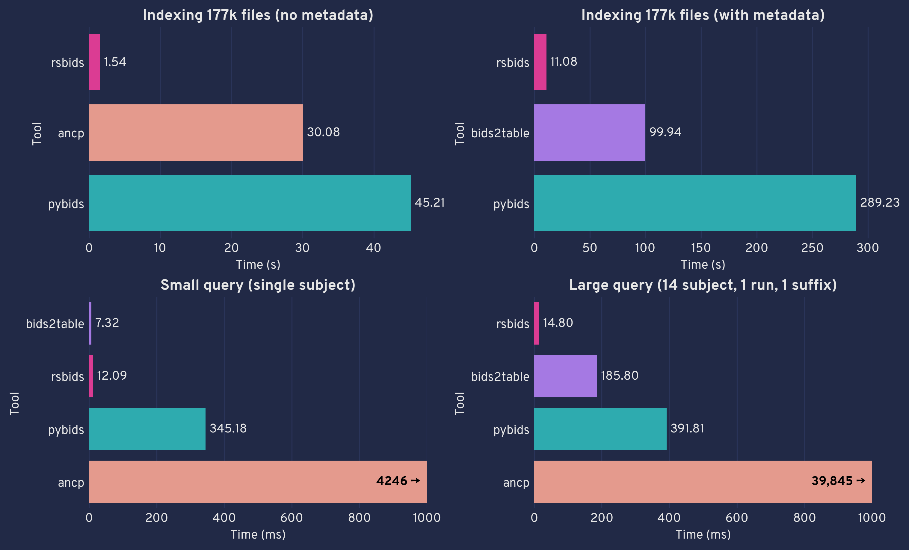

# Benchmarks for BIDs indexers

Benchmarks are calculated on the openly available [_HBN EO/EC task_ dataset](https://openneuro.org/datasets/ds004186/versions/2.0.0), consisting of 177,065 files, including metadata. All tasks are performed using a single core (relevant for `bids2table`, which can use multiple cores). Each of the tasks are run 5 times.

In the table, units are in parenthesis, results are listed as `mean ± std`.


| Tool                                                                      | Indexing (s)   | Indexing w/ Metadata (s)   | Large Query (ms)   | Query (ms)    |
|:--------------------------------------------------------------------------|:---------------|:---------------------------|:-------------------|:--------------|
| [`ancpbids-bids`](https://github.com/ANCPLabOldenburg/ancp-bids) (v0.2.2) | 53.582 ± 0.288 | nan                        | 36.945 ± 0.790     | 3.544 ± 0.066 |
| [`bids2table`](https://github.com/cmi-dair/bids2table) (v0.1.0a0)         | nan            | 107.210 ± 0.969            | 0.146 ± 0.002      | 0.005 ± 0.000 |
| [`pybids`](https://github.com/bids-standard/pybids) (v0.16.3)             | 80.530 ± 0.402 | 317.033 ± 1.788            | 0.310 ± 0.005      | 0.234 ± 0.001 |
| [`rsbids`](https://github.com/pvandyken/rsbids) (v0.0.1a1)                | 2.483 ± 0.055  | 10.127 ± 0.116             | 0.009 ± 0.000      | 0.009 ± 0.000 |



## Tasks

* Indexing: index the dataset without indexing metadata. I wasn't sure how to do this with `bids2table`, so no results are recorded for that library. 
* Indexing w/ Metadata: index the dataset including metadata. This means at least simple metadata fields from sidecar json files (e.g. strings, numbers) can be queried to select matching files. I wasn't sure how to do this with `ancpbids`, so no results are recorded for that library
* Query: On an already indexed dataset (no metadata if possible), select a single subject
* Large Query: As in query, but select 14 subjects, a single run, and a suffix

## Running the benchmarks

The above benchmarks were calculated on a CentOS Linux 7 HCP system with `x86_64` architecture, Intel(R) Xeon(R) CPU E5-2683 v4 @ 2.10GHz, and locally mounted SSD drive.

SLURM jobs were submitted with the `submit.sh` script, which takes as a single argument the pytest mark to be run (one of `indexing`, `metadata`, `query`, `large_query`). In order to load the dataset onto the local SSD drive only available on compute nodes, the script makes a fresh clone of the dataset from a local path, then creates a symlink at `data/<mark>` so that the tests can find the data. To run on a local computing environment, the four symlinks could be made manually, pointing each to the same dataset.

To run the tests, install the dependencies and run:

```sh
pytest tests -m "$mark" --benchmark-save="$mark"
```

where `$mark` is already assigned to one of `indexing`, `metadata`, `query`, or `large_query`.

The data can then be visualized using `benchmarks.ipynb`
